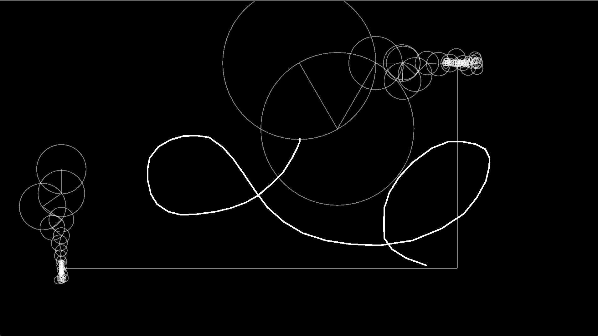

# fourier-draw

SFML-based Fourier transform drawing program



# Requirements
 * C++20
 * CMake 3.16
 * SFML 2.5.1

# Building & Running

```
cmake -B build -DCMAKE_BUILD_TYPE=Release
cmake --build build
cmake --build build --target run
```
